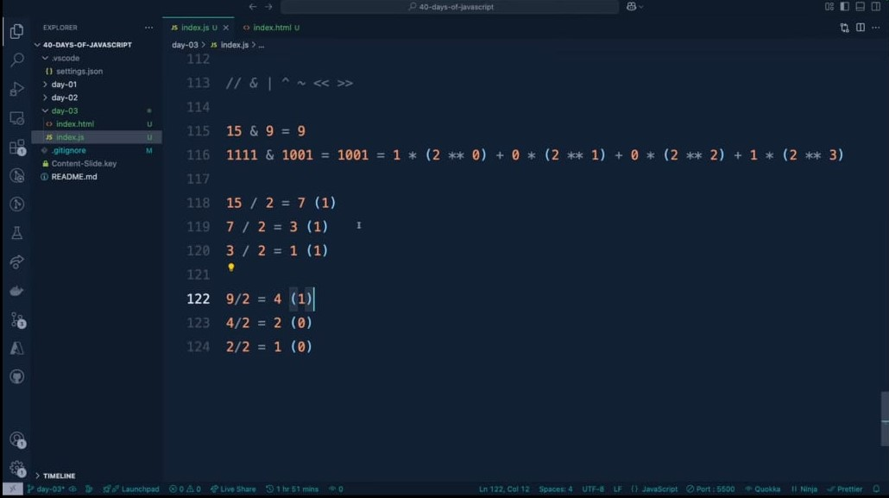
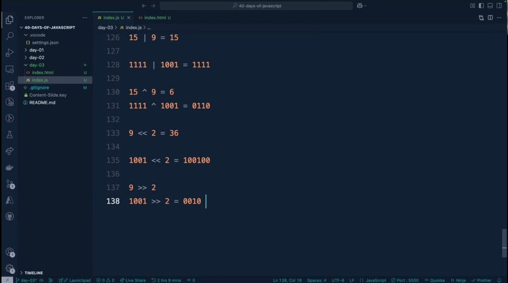

# 🚀 JavaScript Operators And Expressions 🚀

## 🔹 Operands, Operators, and Expressions 🔹

**Expression**: A piece of code that produces a value.

**Operands**: The values that operators work with.

**Operators**: Symbols that perform operations on operands.

```javascript
// Example: 3 + 4
// 3 and 4 are operands
// + is the operator
// The entire '3 + 4' is an expression that evaluates to 7
```

---

## 🌟 Types of Operators in JavaScript 🌟

JavaScript has several categories of operators that serve different purposes in programming.

>1. Arithmetic
>2. Assignment
>3. Comparison
>4. Logical
>5. Conditional (Ternary)
>6. Bitwise
>7. Relational
>8. Type-checking (typeof, instanceof)

### 1️⃣ Arithmetic Operators ➗✖️➕➖

Perform mathematical operations on numeric values.

| Operator | Name | Example | Result |
|:--------:|:----:|:-------:|:------:|
| `+` | Addition | `5 + 3` | `8` |
| `-` | Subtraction | `5 - 3` | `2` |
| `*` | Multiplication | `5 * 3` | `15` |
| `/` | Division | `6 / 2` | `3` |
| `%` | Modulus (Remainder) | `7 % 3` | `1` |
| `**` | Exponentiation | `2 ** 3` | `8` |
| `++` | Increment | `let x = 5; x++;` | `6` |
| `--` | Decrement | `let x = 5; x--;` | `4` |


> ⚠️ **Important**: Pre vs Post increment/decrement
> ```javascript
> let a = 5;
> let b = a++; // Post-increment: b = 5, a = 6
> 
> let c = 5;
> let d = ++c; // Pre-increment: d = 6, c = 6
> ```


---

### 2️⃣ Assignment Operators 📝🔄

Assign values to variables.

| Operator | Description | Example | Equivalent to |
|:--------:|:-----------:|:-------:|:-------------:|
| `=` | Simple assignment | `x = 5` | `x = 5` |
| `+=` | Addition assignment | `x += 3` | `x = x + 3` |
| `-=` | Subtraction assignment | `x -= 3` | `x = x - 3` |
| `*=` | Multiplication assignment | `x *= 3` | `x = x * 3` |
| `/=` | Division assignment | `x /= 3` | `x = x / 3` |
| `%=` | Modulus assignment | `x %= 3` | `x = x % 3` |
| `**=` | Exponentiation assignment | `x **= 3` | `x = x ** 3` |


---

### 3️⃣ Comparison Operators ⚖️🔍

Compare values and return a boolean (true/false).

| Operator | Description | Example | Result |
|:--------:|:-----------:|:-------:|:------:|
| `==` | Equal to (value) | `5 == "5"` | `true` |
| `===` | Strict equal (value and type) | `5 === "5"` | `false` |
| `!=` | Not equal to | `5 != "6"` | `true` |
| `!==` | Strict not equal | `5 !== "5"` | `true` |
| `>` | Greater than | `5 > 3` | `true` |
| `<` | Less than | `5 < 3` | `false` |
| `>=` | Greater than or equal to | `5 >= 5` | `true` |
| `<=` | Less than or equal to | `5 <= 4` | `false` |


> 💡 **Best Practice** ✨
> ```javascript
> // Always prefer === over == for more predictable code
> "0" == false;  // true (coercion happens)
> "0" === false; // false (no coercion, different types)
> ```

---

### 4️⃣ Logical Operators 🧠🔄

Combine or manipulate boolean values.

| Operator | Description | Example | Result |
|:--------:|:-----------:|:-------:|:------:|
| `&&` | Logical AND | `true && false` | `false` |
| `\|\|` | Logical OR | `true \|\| false` | `true` |
| `!` | Logical NOT | `!true` | `false` |

#### 1. Logical AND (`&&`)

The `&&` operator returns the first falsy value encountered or the last value if all operands are truthy.

```javascript
// Basic usage
true && true    // returns true
true && false   // returns false
false && true   // returns false
false && false  // returns false

// Short-circuit evaluation
false && anything   // returns false without evaluating 'anything'

// With non-boolean values
5 && 7          // returns 7 (both are truthy, so last value is returned)
0 && "Hello"    // returns 0 (first falsy value)
"Hello" && ""   // returns "" (empty string is falsy)
[] && {}        // returns {} (both are truthy)

// Practical applications
function greetUser(user) {
  // Only access 'name' property if 'user' exists
  const message = user && user.name ? `Hello, ${user.name}!` : "Hello, guest!";
  return message;
}
```


## Logical OR (`||`)

The `||` operator returns the first truthy value encountered or the last value if all operands are falsy.

```javascript
// Basic usage
true || true    // returns true
true || false   // returns true
false || true   // returns true
false || false  // returns false

// Short-circuit evaluation
true || anything   // returns true without evaluating 'anything'

// With non-boolean values
0 || 5          // returns 5 (first truthy value)
"" || "Hello"   // returns "Hello" (first truthy value)
null || undefined // returns undefined (both falsy, so last value)
false || 0 || "" || null || undefined // returns undefined (all falsy)

// Practical applications
function getUserDisplayName(user) {
  // Provide fallbacks with increasing specificity
  return user.displayName || user.username || user.email || "Anonymous";
}
```


## Logical NOT (`!`)

The `!` operator converts the operand to a boolean and then negates it.

```javascript
// Basic usage
!true     // returns false
!false    // returns true

// With non-boolean values (converts to boolean first, then negates)
!0        // returns true (0 is falsy)
!"Hello"  // returns false ("Hello" is truthy)
!""       // returns true (empty string is falsy)
!{}       // returns false (empty object is truthy)
![]       // returns false (empty array is truthy)
!null     // returns true (null is falsy)
!undefined // returns true (undefined is falsy)

// Double negation (!!) - converts a value to its boolean equivalent
!!0       // returns false
!!"Hello" // returns true
!!""      // returns false
!!{}      // returns true

// Practical applications
function isArrayEmpty(arr) {
  return !(arr && arr.length); // Returns true if array is null, undefined, or empty
}
```

## Nullish Coalescing Operator (`??`)

The `??` operator returns the right-hand operand when the left-hand operand is `null` or `undefined`, otherwise returns the left-hand operand.

```javascript
// Basic usage
null ?? "default"      // returns "default"
undefined ?? "default" // returns "default"
0 ?? "default"         // returns 0 (0 is not null or undefined)
"" ?? "default"        // returns "" (empty string is not null or undefined)
false ?? "default"     // returns false

// Chaining multiple values
null ?? undefined ?? "default" // returns "default"

// Practical applications
function getConfig(options) {
  // Only use default if value is null or undefined
  // This allows falsy values like 0 or "" to be valid settings
  const timeout = options.timeout ?? 3000;
  const retries = options.retries ?? 5;
  return { timeout, retries };
}
```

## Logical Assignment Operators (ES2021)

These operators combine logical operations with assignment.

### Logical AND assignment (`&&=`)

Assigns the right operand to the left only if the left operand is truthy.

```javascript
// Equivalent to: x = x && y
let x = 10;
x &&= 5;  // x becomes 5 (since x was truthy)

let y = 0;
y &&= 5;  // y remains 0 (since y was falsy)

// Practical example
function updateUserSettings(settings) {
  // Only update if 'darkMode' setting exists
  settings.darkMode &&= { enabled: true, contrast: "high" };
}
```

### Logical OR assignment (`||=`)

Assigns the right operand to the left only if the left operand is falsy.

```javascript
// Equivalent to: x = x || y
let x = 0;
x ||= 5;  // x becomes 5 (since x was falsy)

let y = 10;
y ||= 5;  // y remains 10 (since y was truthy)

// Practical example
function ensureDefaultSettings(settings) {
  // Set defaults only if properties are falsy
  settings.theme ||= "light";
  settings.fontSize ||= "medium";
}
```

### Nullish coalescing assignment (`??=`)

Assigns the right operand to the left only if the left operand is null or undefined.

```javascript
// Equivalent to: x = x ?? y
let x = undefined;
x ??= 5;  // x becomes 5 (since x was undefined)

let y = 0;
y ??= 5;  // y remains 0 (since y was not null/undefined)

// Practical example
function initializeConfig(config) {
  // Only initialize if properties are null or undefined
  // This preserves falsy values like 0 or ""
  config.timeout ??= 3000;
  config.maxRetries ??= 5;
  config.autoSave ??= true;
}
```


> 🔍 **Advanced Feature: Short-circuit evaluation** 🚀
> ```javascript
> // && returns the first falsy value or the last value if all are truthy
> let result1 = 5 && 0 && 'hello'; // result1 = 0
> 
> // || returns the first truthy value or the last value if all are falsy
> let result2 = null || 0 || 'hello' || 42; // result2 = 'hello'
> ```

---

### 5️⃣ Conditional (Ternary) Operator 🔀🤔

The only JavaScript operator that takes three operands.

```javascript
condition ? valueIfTrue : valueIfFalse

// Example
let age = 20;
let status = age >= 18 ? 'adult' : 'minor';
// status = 'adult'
```

> 💫 **Pro Tip**: Ternary operators can be nested, but use carefully for readability!
> ```javascript
> let result = age < 13 ? 'child' : (age < 18 ? 'teenager' : 'adult');
> ```

---

### 6️⃣ Bitwise Operators 🔢🔧

Perform operations on binary representations of numbers.

| Operator | Description | Example | Result |
|:--------:|:-----------:|:-------:|:------:|
| `&` | Bitwise AND | `5 & 3` | `1` |
| `\|` | Bitwise OR | `5 \| 3` | `7` |
| `^` | Bitwise XOR | `5 ^ 3` | `6` |
| `~` | Bitwise NOT | `~5` | `-6` |
| `<<` | Left shift | `5 << 1` | `10` |
| `>>` | Right shift | `5 >> 1` | `2` |
| `>>>` | Unsigned right shift | `-5 >>> 1` | `2147483645` |

> 📊 **Visual Explanation** 🖼️
> ```javascript
> // Bitwise operations (visualized in binary)
> // 5 in binary is 101
> // 3 in binary is 011
> 5 & 3  // 001 in binary = 1 in decimal (bits that are 1 in BOTH)
> 5 | 3  // 111 in binary = 7 in decimal (bits that are 1 in EITHER)
> 5 ^ 3  // 110 in binary = 6 in decimal (bits that are 1 in ONE BUT NOT BOTH)
> ```
>>**`How to calculate the binary digit of a number`**




---

### 7️⃣ Relational Operators 🔗🧩

Test relationships between values.

| Operator | Description | Example | Result |
|:--------:|:-----------:|:-------:|:------:|
| `in` | Property in object | `'name' in person` | `true/false` |
| `instanceof` | Instance of object | `person instanceof Person` | `true/false` |

```javascript
// Example with 'in' operator
const car = { make: 'Toyota', model: 'Corolla' };
'make' in car;  // true ✅
'year' in car;  // false ❌

// Example with 'instanceof'
class Vehicle {}
const myCar = new Vehicle();
myCar instanceof Vehicle;  // true ✅
```

---

### 8️⃣ Operator Grouping and Precedence 📚🔝

Operators have different precedence levels that determine the order of evaluation.

```javascript
// Parentheses can be used to explicitly control the order of operations
let result = (2 + 3) * 4;  // result = 20
// Without parentheses: 2 + 3 * 4 = 14 (multiplication happens first)
```

#### **🏆 Operator Precedence 🏆** (from highest to lowest, simplified):

| Precedence | Operator Type | Operators |
|:----------:|:-------------:|:---------:|
| 1 | Grouping | `()` |
| 2 | Member Access | `.`, `[]`, `new`, `()` (function call) |
| 3 | Postfix Increment/Decrement | `++`, `--` (when used after) |
| 4 | Prefix & Unary | `++`, `--` (when used before), `+`, `-`, `!`, `~`, `typeof`, `void`, `delete` |
| 5 | Exponentiation | `**` |
| 6 | Multiply/Divide/Modulus | `*`, `/`, `%` |
| 7 | Addition/Subtraction | `+`, `-` |
| 8 | Bitwise Shift | `<<`, `>>`, `>>>` |
| 9 | Relational | `<`, `>`, `<=`, `>=`, `instanceof`, `in` |
| 10 | Equality | `==`, `!=`, `===`, `!==` |
| 11 | Bitwise AND | `&` |
| 12 | Bitwise XOR | `^` |
| 13 | Bitwise OR | `\|` |
| 14 | Logical AND | `&&` |
| 15 | Logical OR | `\|\|` |
| 16 | Conditional (Ternary) | `? :` |
| 17 | Assignment | `=`, `+=`, `-=`, etc. |
| 18 | Comma | `,` |

---

### 9️⃣ Special Operators 🎯🔮

#### `typeof` Operator 🏷️

Returns a string indicating the type of the operand.

```javascript
typeof 42;               // "number" 🔢
typeof "hello";          // "string" 📝
typeof true;             // "boolean" ✅
typeof undefined;        // "undefined" 🚫
typeof null;             // "object" ⚠️ (this is a historical bug in JavaScript)
typeof {};               // "object" 📦
typeof [];               // "object" 📦 (arrays are objects in JavaScript)
typeof function() {};    // "function" ⚙️
```

#### `instanceof` Operator 🧬

Tests whether an object is an instance of a particular class or constructor.

```javascript
// Class definition
class Person {
  constructor(name) {
    this.name = name;
  }
}

// Creating instances
const john = new Person("John");
const nameStr = "John";

// Testing with instanceof
john instanceof Person;  // true ✅
nameStr instanceof Person;  // false ❌
john instanceof Object;  // true ✅ (all objects inherit from Object)
```

---

## 💡 Tips for Working with Operators 💯

1. **Always use strict equality (`===`) and inequality (`!==`)** ✅  
   Instead of loose equality (`==`, `!=`) to avoid unexpected type conversions.

2. **Be careful with increment/decrement operators** ⚠️  
   The difference between `++x` (pre-increment) and `x++` (post-increment) matters.

3. **Leverage short-circuit evaluation** 🚀  
   For concise code:
   ```javascript
   // Set default value
   let username = userInput || 'Guest';
   
   // Only call function if object exists
   obj && obj.method();
   ```

4. **Operator precedence** 📏  
   When in doubt, use parentheses `()` to make your code more readable and ensure operations happen in the intended order.

5. **Be cautious with bitwise operators** ⚙️  
   They convert operands to 32-bit integers, which might lead to unexpected results with large numbers.


>># Next we will learn about *`Control Flow in Javascript`*
