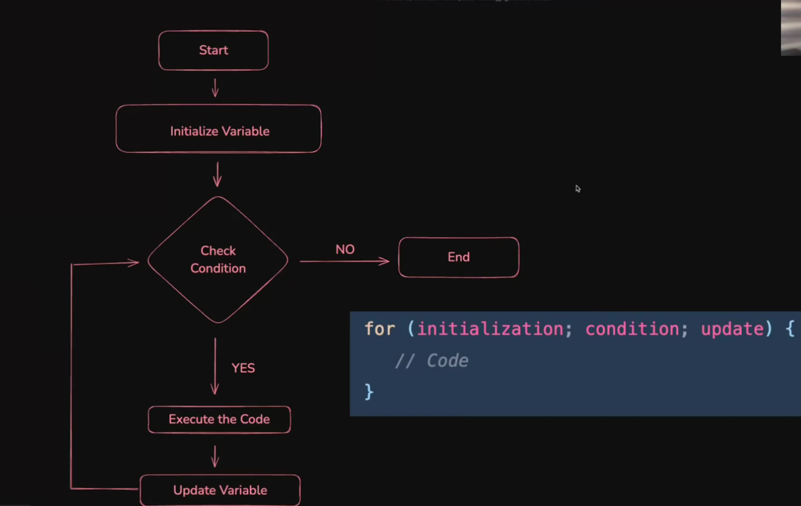

# 🚀 JavaScript Loops & Logic Building 

## 🧠 Logic Building and DSA

**Logic Building** is the foundation of programming that helps you transform problems into step-by-step solutions. It involves:
- 🧩 Breaking down complex problems into smaller, manageable parts
- 📝 Creating algorithms (step-by-step procedures) to solve problems
- 🔧 Using programming constructs like loops, conditionals, and functions

**Data Structures and Algorithms (DSA)** are essential tools for efficient problem-solving:
- 📊 **Data Structures**: Organized ways to store and access data (arrays, objects, sets)
- ⚙️ **Algorithms**: Step-by-step procedures to solve specific problems

## 🔄 Loops in JavaScript

Loops allow you to execute code repeatedly based on a condition. JavaScript offers several types of loops:

### 📋 Types of Loops

JavaScript provides several loop types for different scenarios:

1. 🔂 **`for loop`** - Used when the number of iterations is known
2. 🔁 **`while loop`** - Used when the number of iterations depends on a condition
3. 🔄 **`do-while loop`** - Similar to while loop but guarantees at least one execution
4. 🔠 **`for...in loop`** - Used to iterate over object properties
5. 📦 **`for...of loop`** - Used to iterate over iterable objects (arrays, strings, etc.)
6. 🔄 **`forEach() method`** - Array method that executes a provided function for each array element
7. 🔁 **`map(), filter(), reduce()`** - Functional iteration methods that transform data

### 1. 🔂 `The for Loop`

The `for` loop is used when you know how many times you want to execute a block of code.

**Syntax:**
```javascript
for (initialization; condition; update) {
    // code to be executed
}
```

**Components:**
1. 🏁 **Initialization**: Executed once before the loop starts (e.g., `let i = 0`)
2. ✅ **Condition**: Checked before each iteration; loop continues if true
3. 🔄 **Update**: Executed after each iteration (e.g., `i++`)

### 📊 The for Loop Flow Chart

```
┌─────────────────┐
│  Initialization │
└────────┬────────┘
         │
         ▼
┌─────────────────┐     false
│    Condition    ├─────────────► Exit Loop
└────────┬────────┘
         │ true
         ▼
┌─────────────────┐
│  Execute Code   │
└────────┬────────┘
         │
         ▼
┌─────────────────┐
│     Update      │
└────────┬────────┘
         │
         └─────────────► Return to Condition
```

### ✨ for Loop Examples

**Example 1: Basic counter**
```javascript
for (let i = 1; i <= 5; i++) {
    console.log(`Count: ${i}`);
}
// Output: Count: 1, Count: 2, Count: 3, Count: 4, Count: 5
```

**Example 2: Sum of numbers**
```javascript
let sum = 0;
for (let i = 1; i <= 10; i++) {
    sum += i;
}
console.log(`Sum: ${sum}`); // Output: Sum: 55
```

**Example 3: Iterating through an array**
```javascript
const fruits = ["Apple", "Banana", "Cherry"];
for (let i = 0; i < fruits.length; i++) {
    console.log(`Fruit ${i+1}: ${fruits[i]}`);
}
```

### 🔄➿ Nested Loop

A nested loop is a loop inside another loop. The inner loop completes all its iterations for each iteration of the outer loop.

```javascript
for (let i = 1; i <= 3; i++) {
    for (let j = 1; j <= 3; j++) {
        console.log(`i: ${i}, j: ${j}`);
    }
}
```

**Practical example: Creating a multiplication table**
```javascript
for (let i = 1; i <= 5; i++) {
    let row = '';
    for (let j = 1; j <= 5; j++) {
        row += (i * j) + '\t';
    }
    console.log(row);
}
```

### ⏹️ The break and continue

**break**: Terminates the loop completely
```javascript
for (let i = 1; i <= 10; i++) {
    if (i === 5) {
        break; // Exit the loop when i equals 5
    }
    console.log(i);
}
// Output: 1, 2, 3, 4
```

**continue**: Skips the current iteration and continues with the next one
```javascript
for (let i = 1; i <= 5; i++) {
    if (i === 3) {
        continue; // Skip iteration when i equals 3
    }
    console.log(i);
}
// Output: 1, 2, 4, 5
```

### 📊 Handling Multiple Counters

You can manage multiple variables within a single `for` loop:

```javascript
// Counting up and down simultaneously
for (let i = 1, j = 10; i <= 5; i++, j--) {
    console.log(`i: ${i}, j: ${j}`);
}
// Output: i: 1, j: 10 → i: 2, j: 9 → i: 3, j: 8 → i: 4, j: 7 → i: 5, j: 6
```

### 2. `🔁 The while Loop`

The `while` loop executes a block of code as long as a specified condition is true.

**Syntax:**
```javascript
while (condition) {
    // code to be executed
}
```

**Example:**
```javascript
let i = 1;
while (i <= 5) {
    console.log(`Number: ${i}`);
    i++;
}
```

**When to use:** 🤔 When you don't know in advance how many times the loop should run.

### 3. `🔄 The do-while Loop`

The `do-while` loop is similar to the `while` loop, but it executes the code block at least once before checking the condition.

**Syntax:**
```javascript
do {
    // code to be executed
} while (condition);
```

**Example:**
```javascript
let i = 1;
do {
    console.log(`Number: ${i}`);
    i++;
} while (i <= 5);
```

**Key difference from while loop:** ⚠️ The code always executes at least once, even if the condition is initially false:
```javascript
let i = 6;
do {
    console.log(`This runs once even though i > 5`);
    i++;
} while (i <= 5);
```

### 4. `♾️ Infinite Loop`

An infinite loop occurs when the loop condition always evaluates to true, causing the loop to run indefinitely.

**Example of an infinite loop:**
```javascript
// ⚠️ WARNING: Don't run this without a way to stop execution
for (let i = 1; i > 0; i++) {
    console.log(i); // This will run forever
}
```

**Common causes:**
1. 🚫 Forgetting to update the counter variable
2. ⛔ Setting a condition that will never be false
3. 🔄 Accidentally resetting the counter inside the loop

**How to avoid:**
1. ✅ Always ensure the condition will eventually become false
2. 🔍 Double-check counter updates
3. 🛑 Use a backup exit condition (like a counter limit)

## 💪 Practice Problems for Reinforcement

1. ✏️ Write a loop that prints even numbers from 0 to 20
2. 🌟 Create a nested loop to generate a simple pattern of asterisks
3. 🧮 Use a loop to find the sum of all numbers in an array
4. 🔢 Write a program to find factorial of a number using loops
5. 🔤 Create a loop that iterates through a string and counts vowels

> 💡 **Remember**: The key to mastering loops is practice. Try building different solutions and analyze how loops can make your code more efficient.

## 📝 Quick Reference Table

| Loop Type | Syntax | Best Used When | Special Notes |
|-----------|--------|----------------|--------------|
| for | `for (init; condition; update)` | Known number of iterations | Most versatile loop |
| while | `while (condition)` | Unknown number of iterations | Checks condition first |
| do-while | `do { } while (condition);` | At least one execution needed | Checks condition after execution |
| for...in | `for (key in object)` | Iterating object properties | Don't use for arrays |
| for...of | `for (value of iterable)` | Iterating array values | Modern alternative to traditional for loop |
| Nested loops | loops inside loops | 2D structures, matrices | Watch performance! |


