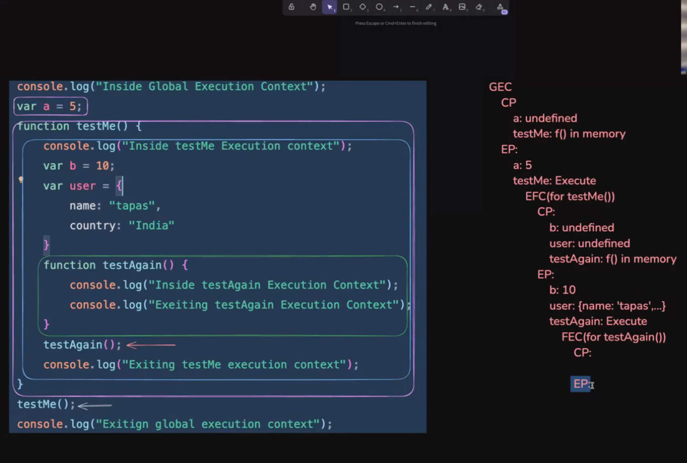
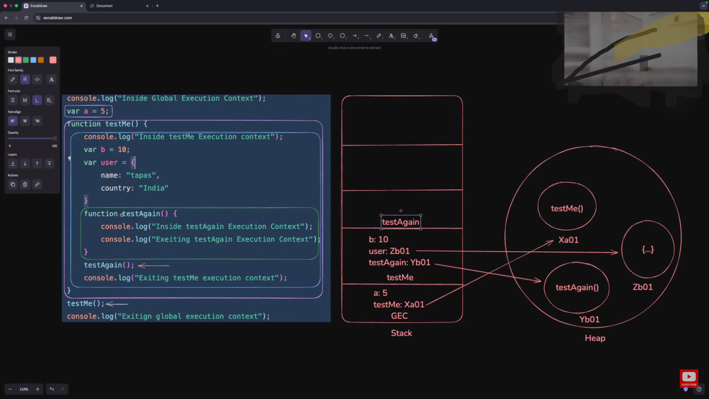

#  🚀 JavaScript Execution Context   🌞Day 08

## 1. 🔍 How JavaScript Works?

JavaScript is a single-threaded, synchronous language (in its core execution), meaning it can only execute one command at a time and in a specific order. However, behind the scenes, it follows a complex process to run code:

1. **📝 Parsing**: Code is parsed to check for syntax errors
2. **🔄 Compilation**: The JavaScript engine compiles the code using Just-In-Time (JIT) compilation
3. **⚙️ Execution**: The code is executed line by line

During execution, JavaScript creates **execution contexts** for running different parts of your code and manages memory using a **call stack** and **heap**.


### 🔄 JavaScript Execution Flow

```
┌───────────────────┐     ┌───────────────────┐     ┌───────────────────┐
│                   │     │                   │     │                   │
│     Parsing       │────▶│    Compilation    │────▶│    Execution      │
│                   │     │                   │     │                   │
└───────────────────┘     └───────────────────┘     └───────────────────┘
```
---

## 2. 🤔 Why Execution Context?

We need execution contexts because:

- 🏠 JavaScript needs an environment to run code
- 📦 It needs to manage variables, functions, and scope
- 🔍 It tracks where in the code execution is happening
- 📚 It maintains the order of execution with the call stack
- 🌐 It separates global code from function code

---

## 3. 📍 Lexical Environment

The lexical environment is where something sits physically in the code you write:

- 📌 It's the **location** where variables and functions are defined
- 🔒 It determines the **scope** of variables (where they can be accessed from)
- 👨‍👧‍👦 It creates a parent-child relationship between nested scopes
- ⛓️ It helps in **scope chaining** - looking up variables in outer scopes if not found in the current scope

### 📊 Visualization of Nested Lexical Environments
```
┌─────────────────────────────────────────┐
│ Global Lexical Environment               │
│                                         │
│ ┌─────────────────────────────────────┐ │
│ │ Function Lexical Environment        │ │
│ │                                     │ │
│ │ ┌─────────────────────────────────┐ │ │
│ │ │ Nested Function Environment     │ │ │
│ │ │                                 │ │ │
│ │ └─────────────────────────────────┘ │ │
│ └─────────────────────────────────────┘ │
└─────────────────────────────────────────┘
```

### 🧩 Code Example

```javascript
// Global lexical environment
const global = "I'm global";         // Global scope

function outer() {                   // Global scope
  // outer function's lexical environment
  const outerVar = "I'm from outer"; // outer's scope
  
  function inner() {                 // outer's scope
    // inner function's lexical environment
    const innerVar = "I'm from inner"; // inner's scope
    console.log(innerVar);  // ✅ Accessible
    console.log(outerVar);  // ✅ Accessible via scope chain
    console.log(global);    // ✅ Accessible via scope chain
  }
  
  inner();
}
```

---

## 4. 🧩 Execution Context

An execution context is a conceptual environment where JavaScript code is evaluated and executed. Each context contains:

1. 📋 **Variable Environment**: All variables and functions declared in the context
2. ⛓️ **Scope Chain**: Links to parent scopes for variable lookup
3. 👉 **`this` value**: Determines what the `this` keyword refers to

### 📊 Execution Context Components
```
┌─────────────────────────────────────────┐
│          Execution Context               │
│                                          │
│  ┌─────────────┐  ┌────────────┐  ┌───┐  │
│  │  Variable   │  │   Scope    │  │   │  │
│  │ Environment │  │   Chain    │  │this│  │
│  └─────────────┘  └────────────┘  └───┘  │
└─────────────────────────────────────────┘
```

JavaScript creates a new execution context for:
- 🌐 The global code (Global Execution Context)
- 🔄 Each function call (Function Execution Context)
- 🧪 Eval code (rarely used)

---

## 5. 🌍 Global Execution Context (GEC)

The Global Execution Context is created when JavaScript starts running and consists of two phases:

### 🏗️ Creation Phase
1. Creates global object (`window` in browsers)
2. Sets up memory space for variables and functions
3. Initializes variables with `undefined` (hoisting)
4. Stores function declarations in memory

### ⚙️ Execution Phase
1. Assigns values to variables
2. Executes code line by line

### 📊 GEC Creation and Execution Phases
```
┌───────────────────────────────┐      ┌───────────────────────────────┐
│      Creation Phase           │      │      Execution Phase          │
│                               │      │                               │
│ ┌─────────┐ ┌───────────────┐ │      │ ┌─────────┐ ┌───────────────┐ │
│ │ Create  │ │ Hoist vars &  │ │      │ │ Assign  │ │ Execute code  │ │
│ │ global  │ │ functions     │ │  ──▶ │ │ values  │ │ line by line  │ │
│ │ object  │ │               │ │      │ │         │ │               │ │
│ └─────────┘ └───────────────┘ │      │ └─────────┘ └───────────────┘ │
└───────────────────────────────┘      └───────────────────────────────┘
```

### 🪟 Window Object
- In browsers, the global object is `window`
- All global variables become properties of the window object
- Global functions become methods of the window object

```javascript
var a = 5;
console.log(window.a); // 5 (in browser)
```

### 👆 `this` Keyword
- In the GEC, `this` refers to the global object (`window` in browsers)
- `this` value changes depending on how a function is called

```javascript
console.log(this); // window object (in browser)
```

---

## 6. 🔄 Function Execution Context (FEC)

A Function Execution Context is created whenever a function is called:

### 🏗️ Creation Phase
1. Creates an `arguments` object (if it's a regular function)
2. Sets up memory space for variables and functions
3. Sets `this` value based on how function is called
4. Establishes scope chain connecting to parent environments

### ⚙️ Execution Phase
1. Assigns values to variables
2. Executes code inside function body
3. Returns value (explicit or implicit `undefined`)

### 📊 FEC Creation and Execution Flow
```
┌───────────────────────┐     ┌───────────────────────┐     ┌───────────────────────┐
│                       │     │                       │     │                       │
│  Function is called   │────▶│   Creation Phase      │────▶│   Execution Phase     │
│                       │     │                       │     │                       │
└───────────────────────┘     └───────────────────────┘     └───────────────────────┘
                                                                       │
                              ┌───────────────────────┐                │
                              │                       │                │
                              │   Return to caller    │◀───────────────┘
                              │                       │
                              └───────────────────────┘
```

### 🧩 Code Example

```javascript
function testMe() {
  var b = 10;         // Local variable in testMe's context
  console.log(b);     // 10
  console.log(this);  // window (in browser, if called normally)
}

testMe(); // Creates a new Function Execution Context
```

### 💡 Practice Exercise
What will be the value of `this` in these different function calls?
```javascript
function showThis() {
  console.log(this);
}

showThis();                    // ?
const obj = { method: showThis };
obj.method();                  // ?
new showThis();                // ?
```

<details>
<summary>See answer</summary>
- When called directly: <code>window</code> (or <code>undefined</code> in strict mode)<br>
- When called as an object method: the object (<code>obj</code>)<br>
- When called with <code>new</code>: a new object instance
</details>


---

## 7. 🧪 GEC and FEC With Complex Examples

Let's analyze the complex example from your learning images:

```javascript
console.log("Inside Global Execution Context");
var a = 5;

function testMe() {
  console.log("Inside testMe Execution context");
  var b = 10;
  var user = {
    name: "tapas",
    country: "India"
  };

  function testAgain() {
    console.log("Inside testAgain Execution Context");
    console.log("Exiting testAgain Execution Context");
  }
  
  testAgain();
  console.log("Exiting testMe execution context");
}

testMe();
console.log("Exiting global execution context");
```

### ⏱️ Execution Timeline

```
┌─────────────────────────┐
│  Global Execution       │
│  Context Created        │
└──────────┬──────────────┘
           │
           ▼
┌─────────────────────────┐
│  GEC execution begins   │
│  "Inside Global..."     │
└──────────┬──────────────┘
           │
           ▼
┌─────────────────────────┐
│  'testMe()' called      │
└──────────┬──────────────┘
           │
           ▼
┌─────────────────────────┐
│  testMe FEC created     │
└──────────┬──────────────┘
           │
           ▼
┌─────────────────────────┐
│  testMe execution       │
│  "Inside testMe..."     │
└──────────┬──────────────┘
           │
           ▼
┌─────────────────────────┐
│  'testAgain()' called   │
└──────────┬──────────────┘
           │
           ▼
┌─────────────────────────┐
│  testAgain FEC created  │
└──────────┬──────────────┘
           │
           ▼
┌─────────────────────────┐
│  testAgain execution    │
│  "Inside testAgain..."  │
└──────────┬──────────────┘
           │
           ▼
┌─────────────────────────┐
│  testAgain FEC removed  │
│  return to testMe       │
└──────────┬──────────────┘
           │
           ▼
┌─────────────────────────┐
│  testMe continues       │
│  "Exiting testMe..."    │
└──────────┬──────────────┘
           │
           ▼
┌─────────────────────────┐
│  testMe FEC removed     │
│  return to GEC          │
└──────────┬──────────────┘
           │
           ▼
┌─────────────────────────┐
│  GEC continues          │
│  "Exiting global..."    │
└─────────────────────────┘
```

### 🔄 Execution Sequence:

1. **🌐 GEC Creation Phase**:
   - `a` is initialized with `undefined`
   - `testMe` function is stored in memory

2. **🌐 GEC Execution Phase**:
   - Prints "Inside Global Execution Context"
   - Assigns 5 to `a`
   - Calls `testMe()` function, which creates new FEC

3. **🔵 testMe FEC Creation Phase**:
   - `b` is initialized with `undefined`
   - `user` is initialized with `undefined`
   - `testAgain` function is stored in memory

4. **🔵 testMe FEC Execution Phase**:
   - Prints "Inside testMe Execution context"
   - Assigns 10 to `b`
   - Assigns object to `user`
   - Calls `testAgain()`, which creates new FEC

5. **🟣 testAgain FEC Creation Phase**:
   - No variables to initialize

6. **🟣 testAgain FEC Execution Phase**:
   - Prints "Inside testAgain Execution Context"
   - Prints "Exiting testAgain Execution Context"
   - Returns to testMe FEC

7. **🔵 Continuing testMe FEC Execution**:
   - Prints "Exiting testMe execution context"
   - Returns to GEC

8. **🌐 Continuing GEC Execution**:
   - Prints "Exiting global execution context"



### 💡 Practice Exercise
Draw the call stack at each step of the execution for this code:
```javascript
function first() {
  console.log('First start');
  second();
  console.log('First end');
}

function second() {
  console.log('Second');
}

console.log('Global start');
first();
console.log('Global end');
```

<details>
<summary>See answer</summary>
1. Call stack: [GEC] - "Global start" prints<br>
2. Call stack: [GEC, first] - first() called<br>
3. Call stack: [GEC, first] - "First start" prints<br>
4. Call stack: [GEC, first, second] - second() called<br>
5. Call stack: [GEC, first, second] - "Second" prints<br>
6. Call stack: [GEC, first] - second() returns<br>
7. Call stack: [GEC, first] - "First end" prints<br>
8. Call stack: [GEC] - first() returns<br>
9. Call stack: [GEC] - "Global end" prints
</details>

---

## 8. 💾 Memory Management With Call Stack and Heap

JavaScript uses two main memory structures:

### 📚 Call Stack
- LIFO (Last In, First Out) data structure
- Tracks execution contexts and their order
- When a function is called, its execution context is pushed onto the stack
- When a function returns, its context is popped off the stack
- Limited in size (causing "stack overflow" errors if exceeded)

### 🗄️ Heap
- Unstructured memory region for storing objects and functions
- Used for data whose size can't be determined at compile time
- Where reference types (objects, arrays, functions) are stored
- Subject to garbage collection when references are no longer needed

### 📊 Call Stack vs Heap Visualization
```
┌───────────────────┐              ┌───────────────────┐
│    Call Stack     │              │       Heap        │
│  (LIFO structure) │              │  (Object storage) │
│                   │              │                   │
│  ┌─────────────┐  │              │    ┌─────────┐    │
│  │ Function C  │  │              │    │{name:'a'}│◀──┼───┐
│  └─────────────┘  │              │    └─────────┘    │   │
│  ┌─────────────┐  │              │                   │   │
│  │ Function B  │  │              │    ┌─────────┐    │   │
│  └─────────────┘  │              │    │[1,2,3]  │◀──┼───┘
│  ┌─────────────┐  │              │    └─────────┘    │
│  │ Function A  │  │              │                   │
│  └─────────────┘  │              │    ┌─────────┐    │
│  ┌─────────────┐  │              │    │function()│    │
│  │    Global   │  │              │    └─────────┘    │
│  └─────────────┘  │              │                   │
└───────────────────┘              └───────────────────┘
      Primitives                      Reference Types
```


### 🔄 How They Work Together

1. **🔢 Primitive data types** (numbers, strings, etc.) are stored directly in the execution context's variable environment on the stack
2. **🔗 Reference data types** (objects, arrays, functions) are stored in the heap, while their references (memory addresses) are stored in the variable environment

In the example from images:
- The stack has GEC at the bottom
- When `testMe()` is called, its FEC is pushed on top
- When `testAgain()` is called, its FEC is pushed on top
- As functions complete, their FECs are popped off
- The objects like `user` are stored in the heap
- References (like Xa01, Yb01, Zb01) link stack variables to heap objects

### 🔄 Memory Management Process
1. **✅ Allocation**: JavaScript automatically allocates memory when values are declared
2. **🔄 Use**: Your code reads/writes to allocated memory
3. **🗑️ Release**: JavaScript's garbage collector automatically frees memory when it's no longer reachable


### 💡 Practice Exercise
Identify what's stored on the stack vs. heap:
```javascript
let name = "Alice";
let age = 30;
let person = { name: "Bob", age: 25 };
let numbers = [1, 2, 3, 4];
```

<details>
<summary>See answer</summary>
- Stack: <code>name</code> ("Alice"), <code>age</code> (30), <code>person</code> (reference), <code>numbers</code> (reference)<br>
- Heap: The object <code>{ name: "Bob", age: 25 }</code>, The array <code>[1, 2, 3, 4]</code>
</details>

---

## 📝 Knowledge Check

Test your understanding with these questions:

1. What are the two main phases of an execution context?
   <details>
   <summary>Answer</summary>
   Creation Phase and Execution Phase
   </details>

2. Where is the variable `a` stored in this code? `var a = { name: "object" };`
   <details>
   <summary>Answer</summary>
   The variable <code>a</code> (the reference) is stored on the stack, while the object itself <code>{ name: "object" }</code> is stored in the heap.
   </details>

3. How many execution contexts are created in this code?
   ```javascript
   function a() {
     b();
   }
   function b() {
     console.log('Hi');
   }
   a();
   ```
   <details>
   <summary>Answer</summary>
   Three: Global Execution Context, Function Execution Context for <code>a()</code>, and Function Execution Context for <code>b()</code>.
   </details>

4. What determines the value of `this` in a function?
   <details>
   <summary>Answer</summary>
   How the function is called (not where it's defined). It could be the global object (default call), an object (method call), a new instance (constructor call), or explicitly set (call/apply/bind).
   </details>

5. What happens to a function execution context after the function returns?
   <details>
   <summary>Answer</summary>
   It is removed (popped) from the call stack.
   </details>


---

## 📔 Glossary

| Term | Definition |
|------|------------|
| **Execution Context** | The environment where JavaScript code is evaluated and executed |
| **🌐 Global Execution Context (GEC)** | The default execution context where global code is executed |
| **🔄 Function Execution Context (FEC)** | Created whenever a function is invoked |
| **📍 Lexical Environment** | The physical location in the code that determines scope |
| **⛓️ Scope Chain** | The connection between current and outer lexical environments |
| **Hoisting** | Moving declarations to the top of their scope during the creation phase |
| **📚 Call Stack** | A data structure that records where in the program we are |
| **🗄️ Heap** | Memory allocation for reference data types (objects, arrays, functions) |
| **🚮 Garbage Collection** | Automatic memory management process that frees unused memory |
| **This Keyword** | A special variable that refers to the object the function is part of |

---

## 📋 Cheat Sheet

### Execution Context Quick Reference

| Context Type | When It's Created | Contents | `this` Value |
|--------------|-------------------|----------|--------------|
| Global EC | When script starts | Global variables and functions | Global object (window) |
| Function EC | When function is called | Local variables, parameters, arguments object | Depends on call pattern |

### Memory Storage Quick Reference

| Data Type | Storage Location | Examples |
|-----------|------------------|----------|
| Primitives | Stack | Numbers, Strings, Boolean, null, undefined, Symbol |
| References | Heap (reference on stack) | Objects, Arrays, Functions, Dates, RegExp |

### Call Stack Operations

| Operation | When It Happens | Effect |
|-----------|-----------------|--------|
| Push | Function is called | Add new execution context to top of stack |
| Pop | Function returns | Remove top execution context from stack |


---

### Common Rules to Remember

1. ✅ JavaScript is single-threaded: one command executes at a time
2. ✅ Each function call creates a new execution context
3. ✅ Variables defined in a function cannot be accessed outside of it
4. ✅ Inner functions can access variables from outer functions
5. ✅ `this` value depends on how a function is called
6. ✅ Primitives are stored on the stack, objects in the heap
7. ✅ The call stack has a size limit (leading to stack overflow errors)
8. ✅ JavaScript automatically manages memory allocation and garbage collection

---

> 💡 **`Pro Tip`**: Understanding execution context is foundational for debugging, closures, asynchronous JavaScript, and performance optimization. Keep referring back to these concepts as you advance!