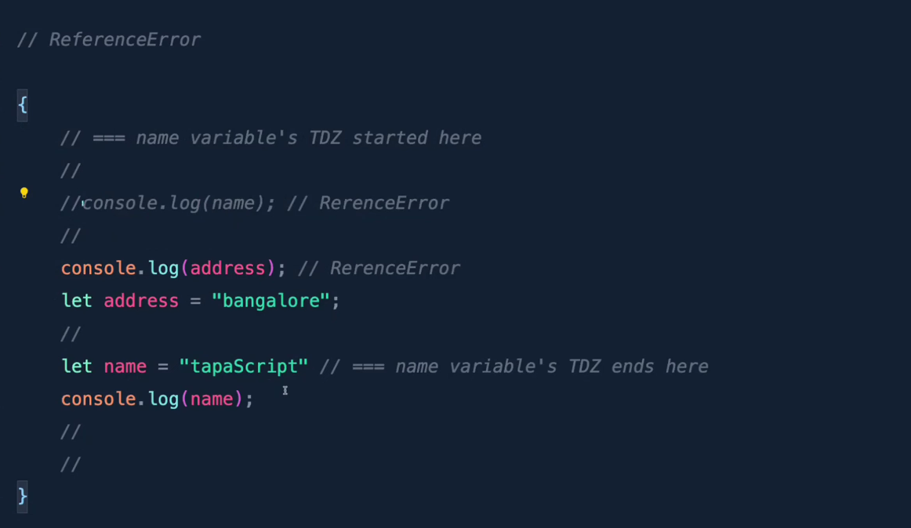

# 🚀 JavaScript Hoisting and Temporal Dead Zone

## 📚 Introduction to Hoisting

**Hoisting** is a JavaScript behavior where variable and function declarations are moved to the top of their containing scope during the compilation phase, before the code is executed. This gives the impression that these declarations were "hoisted" to the top of their scope.

> 💡 **Key Insight**: JavaScript doesn't actually move your code around - it's about how the JavaScript engine processes your code behind the scenes!

## ❓ Common Misconception About Hoisting

Many beginners think that JavaScript physically moves the code to the top of the scope. In reality, what happens is:

1. During the **creation phase** of the execution context, JavaScript allocates memory for variables and functions.
2. Variable declarations are initialized with `undefined` (for `var`) or remain uninitialized (for `let` and `const`).
3. Function declarations are stored in memory with their entire definition.

## 📝 Variable Hoisting

### `var` Variables ⚠️

When using `var`, the declaration is hoisted, but not the initialization:

```javascript
console.log(name); // Output: undefined (not an error!)
var name = "John";
```

What happens behind the scenes:

```javascript
// How JavaScript interprets the code during execution
var name; // Declaration is hoisted
console.log(name); // Outputs: undefined
name = "John"; // Initialization stays where it is
```

### `let` and `const` Variables 🔒

Variables declared with `let` and `const` are also hoisted, but with a crucial difference:

```javascript
console.log(age); // ❌ ReferenceError: Cannot access 'age' before initialization
let age = 25;

console.log(PI); // ❌ ReferenceError: Cannot access 'PI' before initialization
const PI = 3.14;
```

Unlike `var`, accessing `let` and `const` variables before their declaration results in a `ReferenceError`. This leads us to the concept of the Temporal Dead Zone.

## ⏳ Temporal Dead Zone (TDZ)

The **Temporal Dead Zone** is the period between entering the scope where a variable is defined and the actual declaration of that variable. During this period, the variable exists but cannot be accessed.

> `An area where you cannot access a variable until it is initialized.`



```javascript
// 🚫 ReferenceError Zone
{
  // === 🏁 name variable's TDZ started here
  //
  //console.log(name); // ❌ ReferenceError
  //
  console.log(address); // ❌ ReferenceError
  let address = "bangalore";
  //
  let name = "tapaScript"; // === 🏁 name variable's TDZ ends here
  console.log(name); // ✅ Works fine!
  //
  //
}
```

> `TDZ starts with the code in block and end once the variable is intialized.`

### 🔑 Key Points About TDZ:

1. ▶️ The TDZ starts at the beginning of the scope (block, function, or global).
2. ⏹️ The TDZ ends when the variable declaration is reached during execution.
3. ⚠️ Attempting to access the variable during the TDZ throws a `ReferenceError`.
4. 👍 This behavior promotes better coding practices by preventing the use of variables before they're properly declared.

## 🧩 Function Hoisting

### Function Declarations 📢

Function declarations are completely hoisted with their entire body:

```javascript
sayHello(); // ✅ This works!

function sayHello() {
  console.log("Hello, world!");
}
```

JavaScript hoists the entire function definition, making it available throughout its scope.

### Function Expressions 📋

Function expressions behave differently depending on how they're declared:

```javascript
// Using var
console.log(greet); // undefined
greet(); // ❌ TypeError: greet is not a function
var greet = function () {
  console.log("Good morning!");
};

// Using let/const
console.log(welcome); // ❌ ReferenceError: Cannot access 'welcome' before initialization
let welcome = function () {
  console.log("Welcome!");
};
```

With function expressions, only the variable declaration is hoisted, not the function assignment.

## _`📚 Hoisting definition`_

> In JavaScript, before your code actually runs, there is a setup phase called `hoisting`. During this phase, the JavaScript engine creates memory space for `variables` and `functions` and if possible, initializes them. This happens in both the `Global Execution Context` and the `Function Execution Context.`

> > - When a variable is hoisted, it’s called `variable hoisting.`
> > - When a function is hoisted, it’s called `function hoisting.`

> If a variable is declared with `var`, it will be initialized with `undefined` during the `creation phase`. However, if it is declared with `let` or `const`, only _`memory`_ is allocated during the creation phase — `initialization` does not happen at that time.

## 🎬 Real-World Example: The Tom and Jerry Chase


```javascript
// Invoke a function, chase()
chase();

// Declare a function, chase()
function chase() {
  console.log("Tom chases Jerry!");
  // Invoke a function, caught();
  caught();
}

// Declare a function, caught()
function caught() {
  console.log("Tom caught Jerry :(");
}
```

This code works because both function declarations (`chase()` and `caught()`) are hoisted to the top of their scope before execution begins.

### 📊 Execution Context Flow:

1. GEC (Global Execution Context) is created
2. Function declarations are stored in memory
3. Function invocations create their own execution contexts
4. Code execution follows the call stack

## 💯 Best Practices to Avoid Hoisting Issues

1. **Always declare variables at the top of their scope** 🔝: This makes your code more predictable and readable.
2. **Use `let` and `const` instead of `var`** 🔄: The TDZ helps catch potential errors.
3. **Declare functions before using them** 📝: Although function declarations are hoisted, placing them before their calls makes code more readable.
4. **Be aware of function expressions vs. declarations** 🧠: Remember that function expressions aren't fully hoisted.

## 🛠️ Practical Implications

Understanding hoisting helps you:

1. 🐞 Debug unexpected behaviors in your code
2. ✨ Write cleaner, more predictable JavaScript
3. 🧠 Understand JavaScript's execution context model
4. 🚧 Avoid common pitfalls that beginners face

> ⚠️ **Remember**: Just because JavaScript allows some behaviors due to hoisting doesn't mean you should rely on them in your code. Clear, explicit declarations lead to more maintainable code.

## 📝 Summary Table

| Feature                     | `var`                     | `let`/`const`          | Function Declaration | Function Expression                 |
| --------------------------- | ------------------------- | ---------------------- | -------------------- | ----------------------------------- |
| Hoisted?                    | ✅ Yes                    | ✅ Yes                 | ✅ Yes               | ✅ Variable only                    |
| Initial Value               | `undefined`               | TDZ (uninitialized)    | Complete function    | `undefined` (var) or TDZ            |
| Can use before declaration? | ✅ Yes (gets `undefined`) | ❌ No (ReferenceError) | ✅ Yes (works fully) | ❌ No (TypeError or ReferenceError) |
| Scope                       | Function                  | Block                  | Function             | Depends on declaration type         |

---

> 💪 **Practice Task**: Review your existing code and identify any potential hoisting issues or variables in the Temporal Dead Zone. Refactor your code to avoid these potential pitfalls!

## `NEXT: Mastering scope and scope chain in javascript -- Day 10`
