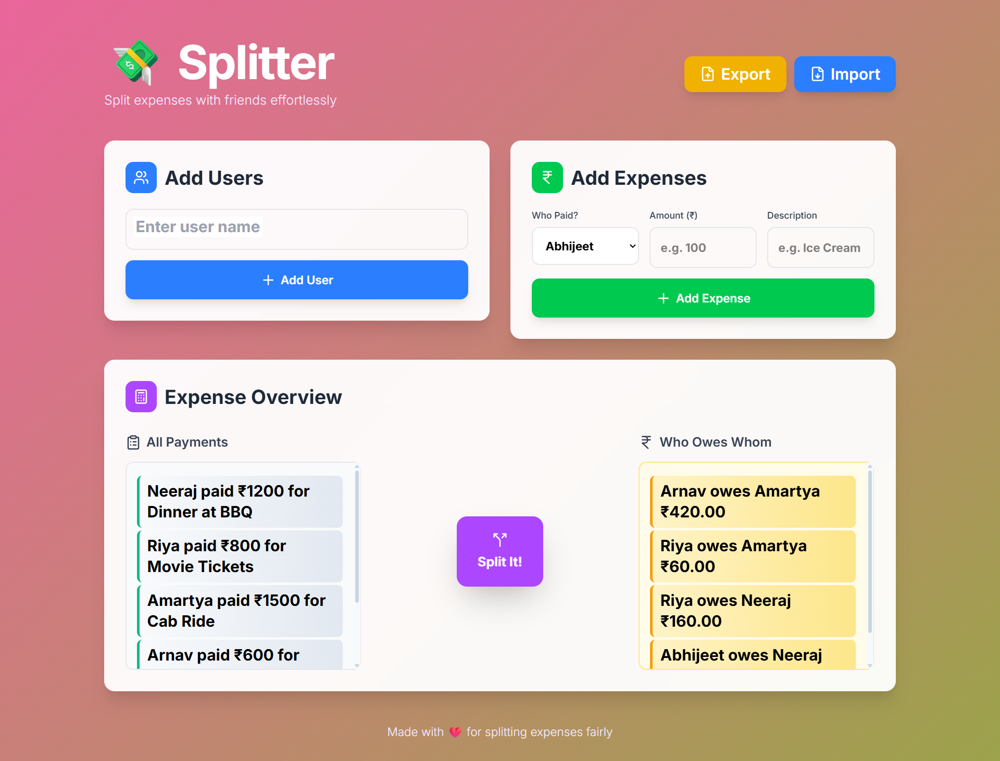

<div align="center">

# Day 40: Master JavaScript with This Real-World Expense Splitter App (Full Guide)🚀


</div>

> *Created by: Neeraj | [LinkedIn: neeraj-kumar1904](https://linkedin.com/in/neeraj-kumar1904) 💼 | [X: @_19_neeraj](https://x.com/_19_neeraj) 🐦 | [GitHub: Neeraj05042001](https://github.com/Neeraj05042001) 🐙* |


<div align="center">


# 💸 Expense Splitter

</div>

**_Split expenses with friends effortlessly — fair, fast, and beautiful._**




## 📌 Overview

Expense Splitter is a lightweight and intuitive web app that helps you track shared expenses among friends, trips, or events — and instantly calculate **who owes whom**. No more awkward math or confusion — just add users, record expenses, and split with a click.

**🔗 Live Demo:** [View Here](https://expense-splitter-pearl-mu.vercel.app/)

**📂 GitHub Repo:** [Open Here](https://github.com/Neeraj05042001/40-Days-Javascript/tree/main/Day%2040/Expense-Splitter)

---

## ✨ Features

✅ **Add Users** — Quickly add all participants

✅ **Log Expenses** — Track who paid what with details

✅ **One-Click Split** — Get instant calculation results

✅ **Who Owes Whom** — Clear breakdown for settlements

✅ **Import/Export** — Save and load expense sessions as JSON

✅ **Responsive UI** — Works great on desktop & mobile

---

## 🛠️ Tech Stack

| Technology           | Purpose                      |
| -------------------- | ---------------------------- |
| **HTML5**            | Structure of the app         |
| **CSS3**, **Tailwind CSS**             | Styling and layout           |
| **JavaScript (ES6)** | Core logic and data handling |
| **JSON**             | Import/Export functionality  |

---

## 🚀 Getting Started

### 1️⃣ Clone the repository

```bash
git clone https://github.com/Neeraj05042001/40-Days-Javascript.git
cd "Day 40/Expense-Splitter"
```

### 2️⃣ Open in browser

Simply open `index.html` in your preferred browser.

---

## 📖 How to Use

1. **Add Users:** Type a participant name and click **Add User**.
2. **Add Expenses:** Choose a payer, enter amount & description, and click **Add Expense**.
3. **Split Costs:** Press **Split It!** to see who owes whom.
4. **Save Data:** Click **Export** to save expenses as JSON.
5. **Load Data:** Click **Import** to upload a saved expense file.

---

## 📸 Screenshots

### Main Interface


---

## 👨‍💻 Author

**Neeraj Kumar**
💖 Made with passion for splitting expenses fairly.

📧 **Connect:** [LinkedIn](https://www.linkedin.com/in/neeraj-kumar-6204721b0/) | [GitHub](https://github.com/Neeraj05042001)

---
